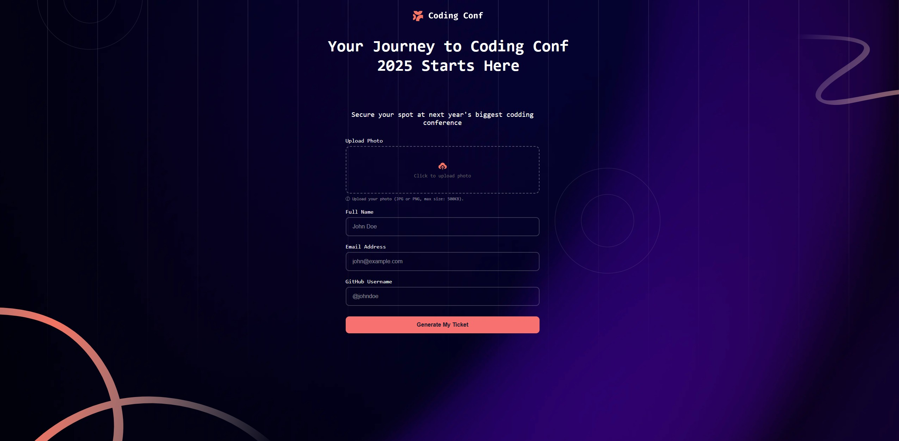
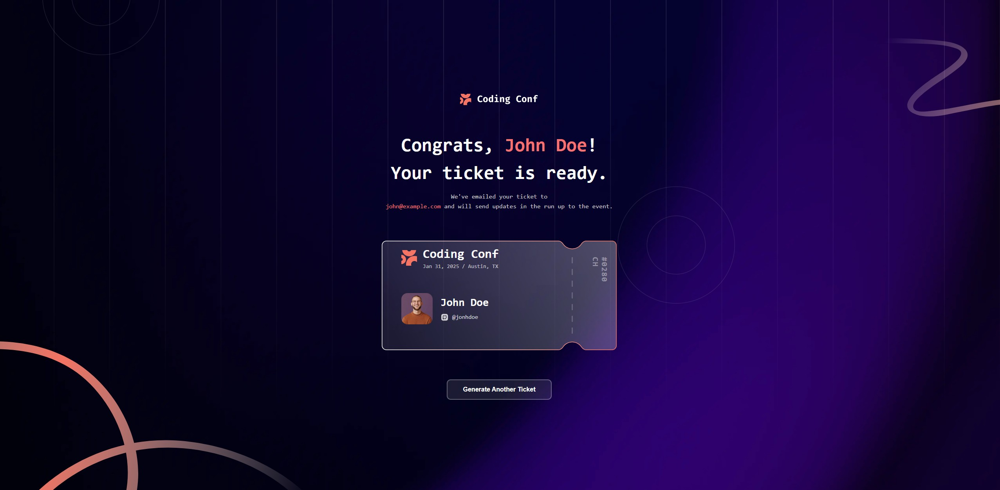

# Conference Ticket Generator

This is a solution to the [Conference ticket generator challenge on Frontend Mentor](https://www.frontendmentor.io/challenges/conference-ticket-generator-oq5gFIU12w). 

## Table of contents

- [Overview](#overview)
  - [The challenge](#the-challenge)
  - [Screenshot](#screenshot)
- [My process](#my-process)
  - [Built with](#built-with)
  - [What I learned](#what-i-learned)
  - [Challenges faced](#challenges-faced)
  - [Continued development](#continued-development)
- [Author](#author)

## Overview

### The challenge

Users should be able to:

- Complete the form with their details
- Upload a profile photo with preview functionality
- Change or remove uploaded photo before submission
- Receive form validation (all fields required before generating ticket)
- Photo size validation (max 500KB)
- See the generated conference ticket with their information
- Generate multiple tickets by resetting the form
- View hover and focus states for all interactive elements

### Screenshot




## My process

### Built with

- Semantic HTML5 markup
- CSS custom properties
- Flexbox
- Vanilla JavaScript
- Custom SVG ticket background
- FileReader API for image upload

### What I learned

This was my first JavaScript project, and I learned several fundamental concepts:

**1. DOM Manipulation**
```js
const photoInput = document.getElementById('photoInput');
const previewImage = document.getElementById('previewImage');
```

**2. Event Listeners**
```js
photoInput.addEventListener('change', function(event) {
    const file = event.target.files[0];
    // Handle file upload
});
```

**3. FileReader API**
```js
const reader = new FileReader();
reader.onload = function(e) {
    previewImage.src = e.target.result;
};
reader.readAsDataURL(file);
```

**4. Form Validation**
```js
function checkFormValidity() {
    const hasPhoto = previewImage.src !== '';
    const hasName = fullNameInput.value.trim() !== '';
    // Enable button only when all fields are filled
}
```

**5. CSS Background Images**
Using a custom SVG as the ticket background instead of creating the design purely with CSS:
```css
.ticket {
    background-image: url('assets/images/pattern-ticket.svg');
    background-size: 100% 100%;
}
```

**6. CSS Positioning**
Learning to position elements precisely, especially the vertical ticket number:
```css
.ticket-number-side {
    writing-mode: vertical-rl;
    position: absolute;
    right: -30px;
    top: 100%;
    transform: translateY(-50%);
}
```

### Challenges faced

**1. CSS Vertical Centering Issues**
The biggest challenge was controlling vertical positioning with `justify-content: center` on the body. This caused unexpected behavior where elements wouldn't move when adjusting margins. The solution was understanding that flexbox centering overrides standard margin adjustments.

**Solution:** Changed from `justify-content: center` to `justify-content: flex-start` and used `margin: auto` on containers when needed.

**2. Aligning Logo with Text**
Initially struggled to align the ticket logo horizontally with "Coding Conf" text. The elements were stacking vertically instead of side-by-side.

**Solution:** 
```html
<div class="event-info">
    
    <div class="event-info-text">
        <h2>Coding Conf</h2>
        <p>Date info</p>
    </div>
</div>
```
```css
.event-info {
    display: flex;
    flex-direction: row;
    align-items: center;
    gap: 15px;
}
```

**3. Photo Upload Preview**
Creating a preview system where users could see, change, or remove their uploaded photo required careful state management and UI updates.

**Solution:** Used separate containers (placeholder and preview) that toggle visibility, with buttons that properly prevent event bubbling using `e.stopPropagation()`.

**4. Vertical Ticket Number Positioning**
Positioning the ticket number vertically and centering it on the right side of the ticket was tricky due to nested positioning contexts.

**Solution:** Used `position: absolute` on the number relative to the ticket-inner container, with `top: 50%` and `transform: translateY(-50%)` for vertical centering.

**5. JavaScript Variable References**
Initially had errors because the code referenced `ticketEmail` element that didn't exist in the updated HTML structure.

**Solution:** Careful review of all JavaScript variables to ensure they matched the actual HTML element IDs, and created separate variables for `headerName` and `headerEmail`.

### Continued development

Areas to improve in future projects:

- Better understanding of CSS positioning contexts (relative, absolute, fixed)
- More efficient CSS organization and naming conventions
- Form validation with proper error messages (not just alerts)
- Accessibility improvements (ARIA labels, keyboard navigation)
- Responsive design for mobile devices
- Image compression before upload
- Better file type validation
- Loading states and animations

### Key Takeaways

- Always check that CSS flexbox properties (especially `justify-content` and `align-items`) aren't interfering with positioning
- DOM element references in JavaScript must exactly match HTML IDs
- `e.stopPropagation()` is essential when buttons are inside clickable containers
- SVG backgrounds can be easier than pure CSS for complex designs
- Writing-mode property is powerful for vertical text
- FileReader API is straightforward for client-side image handling

## Author

- Frontend Mentor - [@Paulochonnn](https://www.frontendmentor.io/profile/Paulochonnn)